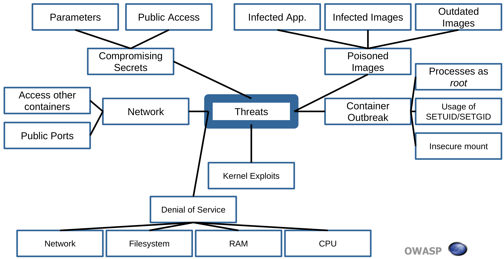

# Threat Modeling

The classical approach how to secure an environment is looking at it from the attacker perspective and enumerate vectors for an attack. This is what this chapter is about.

Those vectors will help you to define what needs to be protected. With this definition one can put security controls in place to provide a baseline protection and beyond. This is what the ten controls in the following chapters are about.

The following image gives an overview of threats in docker.

### Threat 1: Container Escape (System)

In this scenario the application is insecure in a way that some kind of shell access is possible. So the attacker managed e.g. from the internet to successfully stage an attack in which he has managed to escape the application and ended up to be in the container. The container is as the name indicates supposed to contain him.

In a second stage he would try to escape the container, either as the container user from a view of the host or with a kernel exploit. In the first scenario he would just end up with user privileges on the host. In the second scenario he would be root on the host system which gives him control over all containers running on that host.

### Threat 2: Other Containers via Network

This scenario has the same first stage as the previous one. The attacker has also shell access but then he chooses to attack another container through the network. That could either be from the same application, a different application from the same customer, or in a multi-tenant environment one from another customer.

### Threat 3: Attacking the Orchestration Tool via Network

This scenario has the same first vector as the previous two. The attacker has shell access within the container but he chooses to attack the management interfaces or other attacks surfaces of the orchestration tool -- the management back-plane. In 2018 almost every tool has had a weakness here which was a default open management interface. "Open" means in the worst case an open port without authentication. (citations needed).

### Threat 4: Attacking the Host via Network

This again has the same first vector as the one mentioned before. With his shell access he attacks an open port from the host. If it is weakly protected or not at all he get's user - or worse - root access to the host.

### Threat 5: Attacking other Resources via Network

This is basically a threat which collects all remaining network-based threats into one bucket.

This again has the same first vector as the one mentioned before. With his shell access he finds e.g. an unprotected network-based file system which is shared among the containers where he could read or even modify data. Another possibility would be resources like an Active or LDAP Directory. Yet another resource could be e.g. a Jenkins which has somebody configured too open and is accessible from the container.

(clarification needed because of ARP spoofing & switch): Also it could be possible that the attacker installs a network sniffer into the container he hijacked so that he might be able to read traffic from other containers

### Threat 6: Resource Starvation

The underlying vector is due to a security condition from another container
running on the same host. The security condition could be due to the
fact that the other container is eating up resources which could be CPU cycles,
RAM, network or disk-I/O.

It could also be that the container has a host file system mounted which the
attacker has been filling up which causes problems on the host which in turn
affects other containers.

### Threat 7: Host compromise

Whereas in the previous threat the attacker managed indirectly over the host to affect
another / other containers, here the attacker has compromised the host -- either through
another container or through the network.

### Threat 8: Integrity of Images

The CD pipeline could involve several hops where the mini operating system image is
been passed from one step to the next until it reaches the deployment.

Every hop is a potential attack surface for the attacker. If an attacker manages
to get a foothold into one step and there's no integrity check whether what will be
deployed is what should be deployed there is the threat that on behalf of the
attacker images with his malicious payloads are being deployed.

